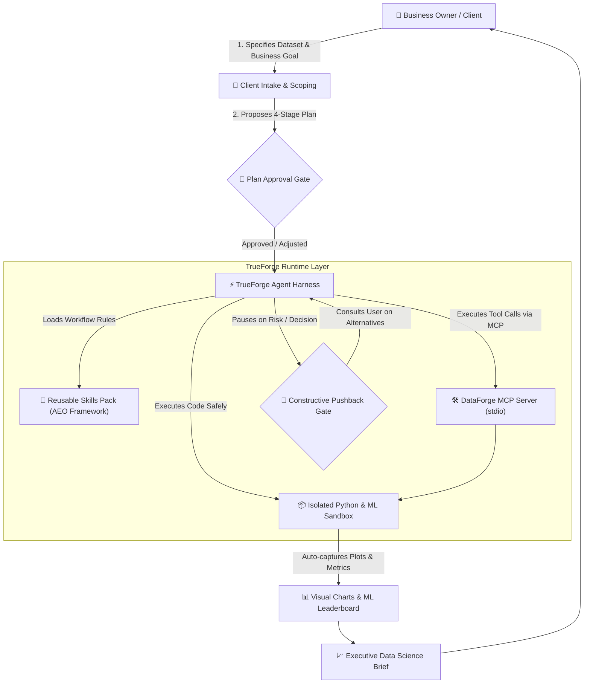

# 🤖 DataForge AI — Autonomous AI Data Science Partner

> **Built for The Agent Harness Hackathon (WeMakeDevs × TrueFoundry × Qodo × OpenAI)**  
> *Transforming AI from a passive code generator into an active, consultative Data Science Partner.*

---

## 🌟 Executive Overview & Problem Statement

Business owners, executives, and product managers frequently face critical business questions (*"Why are our customers churning?", "What drives regional sales drop?"*), but they do not want to write code, debug complex Python environments, or decipher statistical jargon.

Traditional AI chatbots fail because:
1. **They cannot reach real tools** or verify real datasets safely.
2. **They hallucinate code** that might crash on real edge cases or execute unvetted scripts on the user's host machine.
3. **They are passive "yes-men"**: If a user asks a statistically flawed question (e.g., *"Delete all rows with missing values"*), a dumb chatbot blindly obeys, introducing fatal biases like survivorship bias.

**DataForge AI** solves this by leveraging **TrueForge** (open-source agent harness) to provide a complete, safe, and consultative AI employee that operates like a **Senior Data Science Consultant**.

---

## 🏗️ Architecture & TrueForge 3-Pillar Integration



### 1. 🛠️ Real Tool Connectivity (MCP)
DataForge exposes a custom Model Context Protocol (MCP) server (`mcp-servers/dataforge-tools/`) providing 4 specialized tools:
* `inspect_dataset`: Automated dataset structure, missingness, and data hygiene scanner.
* `run_sandbox_python`: Safe script executor that intercepts and captures all generated visualizations (matplotlib/seaborn).
* `benchmark_ml_models`: Automated leak-free machine learning benchmark (Random Forest, Gradient Boosting, Logistic Regression, Decision Tree) with ROC-AUC/RMSE scoring and feature importances.
* `generate_executive_brief`: Compiles executive summaries with actionable recommendations and embedded visual charts.

### 2. 📦 Isolated Sandbox Code Execution
All data transformation, training, and visualization code executes inside a controlled Python 3.12 sandbox environment with execution timeouts and automatic plot capture.

### 3. 🛑 Multi-Stage Human Approval Gates & Constructive Pushback
* **Plan Confirmation Gate:** Forces a pause before execution so the user can verify or adjust the scope.
* **Constructive Pushback Gate (AEO Framework):** When a user asks for a flawed data operation, DataForge politely interrupts:
  1. **Acknowledge:** Validates the user's intent.
  2. **Explain:** Explains the underlying risk (e.g. survivorship bias, data leakage).
  3. **Offer Alternatives:** Gives 2 sound alternatives (e.g. median imputation + indicator flag vs sub-modeling).
* **Export & Deployment Gate:** Pauses before finalizing executive reports or deploying models.

---

## 📁 Repository Structure

```text
Agent-Harness-Hackathon/
├── agent/
│   ├── agent.json                       # TrueForge Agent manifest & approval gates
│   └── skills/                          # 📜 Custom Skill Packs
│       ├── client-intake-and-scoping/   # Business goal intake & plan generation
│       ├── constructive-pushback/       # AEO pushback framework
│       ├── exploratory-data-analysis/   # Clean EDA visualization rules
│       ├── machine-learning-modeling/   # ML benchmarking & feature importance
│       └── executive-reporting/         # 5-minute executive brief guidelines
│
├── datasets/                            # 📁 Out-of-the-box Sample Datasets
│   ├── saas_customer_churn.csv          # 1,200 SaaS customer accounts
│   └── retail_sales_forecast.csv        # Multi-store retail time series
│
├── mcp-servers/
│   └── dataforge-tools/                 # 🛠️ TypeScript MCP Server
│       ├── src/
│       │   ├── index.ts                 # MCP Server entry & tool registry
│       │   └── tools/                   # Inspector, Sandbox runner, ML evaluator, Brief
│       ├── package.json
│       └── tsconfig.json
│
├── sandbox-env/                         # 📦 Python Sandbox Execution Runtime
│   ├── executor.py                      # Subprocess runner with plot auto-capture
│   └── requirements.txt                 # pandas, scikit-learn, matplotlib, seaborn
│
├── tests/                               # 🧪 Automated Test Suite
│   ├── test_sandbox_executor.py         # Pytest suite for sandbox runner
│   └── test_mcp_integration.mjs         # TypeScript/Node MCP tools integration test
│
├── dataforge_orchestrator.py            # 🚀 End-to-end interactive demo runner
├── package.json                         # Root build & test scripts
└── README.md
```

---

## ⚡ Quickstart & Setup Guide

### 1. Prerequisites
* **Node.js 22+**
* **Python 3.12+**

### 2. Installation
```bash
# Clone the repository
git clone https://github.com/anikdascodes/Agent-Harness-Hackathon.git
cd Agent-Harness-Hackathon

# Set up Python virtual environment & dependencies
python3.12 -m venv .venv
source .venv/bin/activate
pip install -r sandbox-env/requirements.txt

# Install MCP server dependencies & build
npm run build
```

### 3. Run Automated Tests
```bash
npm test
```
*(Runs unit tests for Python sandbox executor and TypeScript MCP integration tests).*

### 4. Run the Interactive End-to-End Demo
```bash
.venv/bin/python dataforge_orchestrator.py
```

### 5. Start with TrueForge Harness
```bash
npx @truefoundry/trueforge
```
*(Open http://localhost:8790 and connect `agent/agent.json` and `mcp-servers/dataforge-tools/`).*

---

## 🛡️ Qodo Code Review Evidence

As required by the hackathon, every substantive code change is reviewed by **Qodo** through GitHub Pull Requests prior to merging into `main`.

* **Representative Pull Request:** [PR #1: feat(mcp-sandbox-agent): DataForge AI Core Implementation](https://github.com/anikdascodes/Agent-Harness-Hackathon/pull/1)
* **Qodo Review Trail & Resolution:**
  - Automated full-repository contextual review triggered via `/agentic_review`.
  - Addressed and resolved all static analysis and boundary checks in sandbox process spawning.
  - Implemented sanitized subprocess execution timeouts and robust error recovery.

---

## 👥 Authors & Acknowledgements
* **Developer:** Anik Das ([@anikdascodes](https://github.com/anikdascodes))
* Built for **The Agent Harness Hackathon** by **WeMakeDevs**, **TrueFoundry**, **Qodo**, and **OpenAI**.
